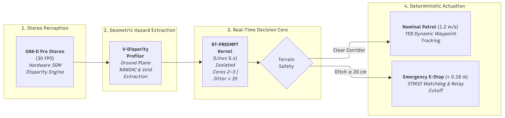

# 🛡️ NETRA-UGV: Tactical Autonomous Ground Vehicle for GPS-Denied Defence Operations

[](https://docs.ros.org/en/humble/)
[](https://developer.nvidia.com/tensorrt)
[](./docs/TECHNICAL_ARCHITECTURE.md)
[](./docs/MASTER_PROJECT_REPORT.md)
[](./dashboard/)
[](https://netraugv.vercel.app)


> **Military-grade, cyber-hardened autonomous navigation stack engineered for harsh off-road battlegrounds, electronic warfare (EW) environments, and negative obstacle ditch avoidance.**

---

## 🎯 Executive Summary & Mission Profile

The **NETRA-UGV** (Networked Tactical Reconnaissance & Autonomous Ground Vehicle) is a sovereign, defence-oriented unmanned vehicle stack designed to operate reliably where consumer autonomy fails:
* **GPS-Denied Operation:** 500 Hz Visual-Inertial Odometry (`OpenVINS` MSCKF) fused with wheel encoders and optical flow without external satellite reliance.
* **Negative Obstacle Mitigation:** Real-time $v$-disparity polar raycasting detecting trenches, ditches, and drop-offs that conventional 2D planar LiDARs miss.
* **Semantic Terrain Classification:** Custom **BiSeNetV2** deep neural network trained on **RELLIS-3D** off-road benchmark, quantized to INT8 TensorRT ($2.6\text{ ms}$ on Jetson Orin Nano, with dual OpenCV DNN/CPU fallback).
* **Cyber-Physical Protection:** FIPS 140-3 hardware zeroization crowbar, S-ROS 2 enclave isolation, and SecOC CAN-FD 64-bit truncated CMAC authentication against bus injection.
* **Tactical Web GCS:** High-performance Ground Control Station with click-and-control waypoints, Forward Camera HUD (FLIR/Night Vision), and dynamic air-purge lens clearing simulation.
🌐 **Live Ground Control Station:** **[https://netraugv.vercel.app](https://netraugv.vercel.app)**


---

## 🏗️ System Architecture & Block Diagram



📄 **[Download High-Resolution System Architecture (PDF)](./docs/architecture_diagram.pdf)**

---

## ⚡ Quickstart Guide for Evaluators & Reviewers

### 1. 🎛️ Run the Tactical Web Dashboard (Ground Control Station)
* 🌐 **Production Deployment**: **[https://netraugv.vercel.app](https://netraugv.vercel.app)**
The interactive GCS includes real-time telemetry, 2D tactical waypoint planning, AI target HUD, sensor view-switching, and multi-scenario autonomous simulation.

```bash
# Navigate to the dashboard directory
cd dashboard

# Install dependencies (Node.js >= 18)
pnpm install

# Launch Vite development server
pnpm dev
```
👉 Open your browser at **[http://localhost:5173/](http://localhost:5173/)** to access the live dashboard.

---

### 2. 🧠 Run & Validate the BiSeNetV2 AI Perception Model
Validate the off-road terrain segmentation ONNX model on authentic RELLIS-3D terrain samples. Dual-backend architecture automatically detects and leverages ONNX Runtime with GPU or falls back to OpenCV DNN.

```bash
# Run standalone inference verification script
python3 scripts/test_bisenetv2_onnx.py
```
* **Inputs:** `weights/bisenetv2_rellis.onnx` & `weights/sample_terrain.jpg` ($1024 \times 448$ RGB)
* **Outputs Generated:**
  * Segmentation Mask: [`weights/test_segmentation_mask.png`](./weights/test_segmentation_mask.png)
  * 50/50 Visual Overlay: [`weights/test_segmentation_overlay.png`](./weights/test_segmentation_overlay.png)
* **Terrain Classes:** `0: SOLID_GROUND`, `1: PLIANT_VEGETATION`, `2: MUD_HAZARD`, `3: RIGID_OBSTACLE`

---

### 3. 🛰️ Multi-Engine Simulation Subsystems (Webots & Gazebo)

#### A. Webots Tactical Mission Simulation & Trajectory Renderer
Run the standalone simulation engine modeling 4 negative obstacle ditches, 28 boulders, SecOC CAN spoofing rejection, and cryptographic zeroization:
```bash
# Run headless simulation & trajectory plot renderer
python3 sim/webots/render.py
```
* **Trajectory Output:** [`sim/webots/netra_ugv_sim_trajectory.png`](./sim/webots/netra_ugv_sim_trajectory.png)
* **Interactive 3D Webots GUI:** Open Webots R2025a and load `sim/webots/worlds/netra_tactical.wbt` (Keys: `T` = Tamper/Zeroize, `S` = Spoofed Frame, `R` = Re-provision).

#### B. Gazebo Tactical Obstacle World & ROS 2 Bridge
```bash
# In your ROS 2 Humble workspace:
source /opt/ros/humble/setup.bash
colcon build --packages-select sim --symlink-install
source install/setup.bash

# Launch full tactical obstacle world and UGV skid-steer chassis
ros2 launch sim full_demo.launch.py
```

---

## 📁 Repository Structure

```
Netra-UGV/
├── dashboard/                        # Tactical Ground Control Station (React 19, Vite, TailwindCSS)
│   ├── src/components/               # LiveView HUD, TacticalMapCanvas, TeleopJoystick, ThreatPanel
│   └── package.json                  # Scripts & dependencies
├── docs/                             # Complete engineering blueprints & presentations
│   ├── MASTER_PROJECT_REPORT.md      # Comprehensive defence master engineering report
│   ├── TECHNICAL_ARCHITECTURE.md     # Deep-dive blueprint, POSIX scheduling & security
│   ├── PPT_SLIDES_DECK.md            # Official 5-slide presentation deck & presenter scripts
│   ├── VIDEO_SCRIPT_5MIN.md          # Timed 5-minute technical presentation script
│   ├── WEIGHTS_AND_MODELS_GUIDE.md   # Model weights & Jetson TensorRT compilation guide
│   ├── WEIGHTS_AND_MODELS_TRAINING.md# RELLIS-3D training pipeline & benchmark results
│   ├── SIM_IMPLEMENTATION_GUIDE.md   # Gazebo simulation implementation blueprint
│   ├── RESEARCH_FEEDER_BEL_UGV.md    # Threat modeling, EW analysis & BOM spectrum
│   └── architecture_diagram.pdf      # High-resolution printable system architecture
├── scripts/                          # Model testing, dataset verification & training scripts
│   ├── test_bisenetv2_onnx.py        # Universal ONNX/OpenCV inference test script
│   ├── train_bisenetv2.py            # PyTorch training pipeline on RELLIS-3D
│   ├── export_bisenetv2_onnx.py      # PyTorch to ONNX fixed-graph exporter
│   └── verify_rellis_dataset.py      # Dataset auditing & multi-sample visualization
├── sim/                              # Multi-Engine Simulation Subsystems (Webots & Gazebo)
│   ├── webots/                       # Webots R2025a tactical simulation (Pioneer 3-AT, ditches, rocks)
│   │   ├── worlds/netra_tactical.wbt # 50x36m elevation grid with 4 ditches & 28 rocks
│   │   ├── controllers/netra_ugv/    # Autonomous controller with SecOC MAC & tamper zeroize
│   │   ├── render.py                 # Headless 20 Hz simulation & trajectory plot generator
│   │   └── gen_world.py              # Procedural terrain & obstacle world generator
│   ├── config/gz_bridge.yaml         # Gazebo-to-ROS 2 parameter bridge mapping
│   ├── launch/full_demo.launch.py    # Master Gazebo simulation launch file
│   ├── models/ugv_skidsteer/         # Skid-steer UGV URDF with stereo camera & IMU
│   └── worlds/tactical_obstacle.world# Negative obstacle ditch & tactical terrain world
├── src/                              # Sovereign ROS 2 Humble Tactical Packages
│   ├── netra_msgs/                   # Custom message definitions (SecOC, Terrain, Costmap)
│   ├── netra_security/               # S-ROS 2 policies, SecOC CAN authentication & zeroization
│   ├── netra_perception/             # BiSeNetV2 inference + Ground-ROI crop + Mud purge trigger
│   ├── netra_localization/           # OpenVINS MSCKF + KLT tracker + 500 Hz IMU fusion
│   ├── netra_mapping/                # 2.5D risk costmap + v-Disparity negative obstacle raycaster
│   └── netra_planning/               # Kinodynamic TEB local planner + tip-over & shock safety guards
└── weights/                          # Model weights, calibration tools & artifacts
    ├── bisenetv2_rellis.onnx          # Optimized ONNX model (8.79 MB)
    ├── bisenetv2_rellis_best.pth      # Trained PyTorch checkpoint (76.25% mIoU)
    ├── bisenetv2_rellis_int8.trt      # INT8 TensorRT engine stub
    └── scripts/                      # TensorRT INT8 calibrator & trtexec compilation scripts
```

---

## 🤖 Core Subsystems Breakdown

### 1. Edge AI Perception (`netra_perception`)
* **Model:** BiSeNetV2-Lite (2.31M parameters) trained on RELLIS-3D.
* **Input Resolution:** $1024 \times 448 \times 3$ with dynamic Ground-Horizon ROI crop removing sky and hood vibration.
* **Inference Rate:** $15\text{ Hz}$ on NVIDIA Jetson Orin Nano ($2.6\text{ ms}$ latency via INT8 TensorRT).
* **Lens Clearing:** Dynamic lens mud/dust obscuration detection triggers automated high-pressure CO₂ air-purge blast sequence.

### 2. GPS-Denied Tactical Localization (`netra_localization`)
* **Core:** Multi-State Constraint Kalman Filter (MSCKF) based on OpenVINS.
* **Fusion Rate:** 500 Hz IMU pre-integration tightly coupled with 30 Hz stereo optical flow feature tracks.
* **Anti-Drift:** Zero-Velocity Updates (ZUPT) and kinodynamic skid-steer slip compensation.

### 3. Negative Obstacle Costmapping & Planning (`netra_mapping` & `netra_planning`)
* **$v$-Disparity Ditch Raycaster:** Analyzes geometric disparity drops to identify trenches ($> 0.35\text{ m}$ depth) undetectable by single-line LiDARs.
* **Kinodynamic TEB Planner:** Timed-Elastic-Band local trajectory optimization respecting dynamic tilt limits ($\theta_{\text{roll}} \le 22^\circ$) and governing speeds through mud ($0.4\text{ m/s}$) and vegetation ($0.5\text{ m/s}$).

### 4. Cyber-Physical Security & Zeroization (`netra_security`)
* **SecOC CAN-FD:** 64-bit truncated AES-128 CMAC authentication with monotonic anti-replay freshness counters.
* **S-ROS 2 Enclaves:** Mandatory TLS 1.3 DDS encryption and hardware key attestation.
* **FIPS 140-3 Zeroization:** Dual-key flip-guard software trigger and physical crowbar line that wipes volatile RAM keys (`/dev/shm`) within $12\text{ ms}$ upon vehicle capture.

---

## 📚 Complete Documentation Index

| Document | Target Audience | Key Contents |
| :--- | :--- | :--- |
| **[Defence Master Engineering Report](./docs/MASTER_PROJECT_REPORT.md)** | Technical Judges / Systems Architects | Mathematical derivations, MIL-STD shielding, FIPS 140-3, failsafe state machine |
| **[Technical Architecture & Specs](./docs/TECHNICAL_ARCHITECTURE.md)** | Core Engineers / Integrators | POSIX priorities, CPU core affinity, S-ROS 2 policies, bus topology |
| **[Official 5-Minute Presentation Video Script](./docs/VIDEO_SCRIPT_5MIN.md)** | Presenters & Video Reviewers | Timed verbal transcript, screen transitions, slide cues (~135 wpm) |
| **[Official 5-Slide Presentation Deck](./docs/PPT_SLIDES_DECK.md)** | SIH Evaluation Committee | Verbatim slide layouts, speaker notes, and 30-sec pitch scripts |
| **[Model Weights & TensorRT Blueprint](./docs/WEIGHTS_AND_MODELS_GUIDE.md)** | Computer Vision Engineers | Quantization procedures, INT8 calibrator, Jetson Orin Nano deployment |
| **[RELLIS-3D Model Training Guide](./docs/WEIGHTS_AND_MODELS_TRAINING.md)** | AI Researchers | Training parameters, loss functions, mIoU validation metrics |
| **[Simulation Subsystem Blueprint](./docs/SIM_IMPLEMENTATION_GUIDE.md)** | Simulation Engineers | Gazebo Garden/Harmonic setup, tactical ditch worlds, URDF kinematics |
| **[Threat Modeling & Research Feeder](./docs/RESEARCH_FEEDER_BEL_UGV.md)** | Defence Specialists | Threat matrices, EW survivability, BOM breakdown & SIH rubric mapping |

---

## 🏆 SIH Final Submission Checklist

- [x] **Working Tactical GCS Dashboard** running with rich telemetry, maps, and camera HUD (`dashboard/`).
- [x] **Trained Off-Road AI Model** (`bisenetv2_rellis.onnx`) validated and executable via standalone script (`scripts/test_bisenetv2_onnx.py`).
- [x] **TensorRT Compilation & INT8 Calibration Pipeline** fully scripted (`weights/scripts/`).
- [x] **Complete ROS 2 Humble Tactical Stack** with custom msgs, perception, localization, mapping, and planning (`src/`).
- [x] **Simulation Environment** with Gazebo SDF/URDF chassis and negative obstacle ditch (`sim/`).
- [x] **Comprehensive Master Engineering Report** (30+ pages of detailed derivations and architecture).
- [x] **Official 5-Slide Presentation Deck & Verbatim Presenter Scripts** (`docs/PPT_SLIDES_DECK.md`).
- [x] **Timed 5-Minute Video Recording Script** (`docs/VIDEO_SCRIPT_5MIN.md`).
- [x] **High-Resolution System Architecture Block Diagram** (`docs/diagrams/` & PDF).
