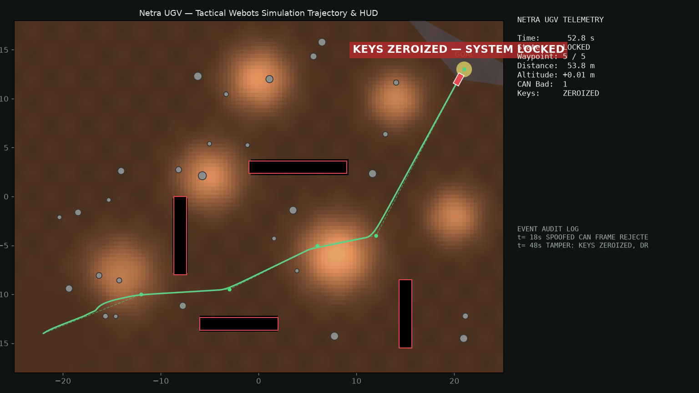

# 🤖 NETRA-UGV Webots Tactical Simulation Subsystem

This directory contains a complete **Webots (R2025a)** robotics simulation environment for the **NETRA-UGV** platform, modeling realistic battlefield terrain dynamics, sensor payloads, negative obstacle detection, and SecOC cyber-defence failsafes.



---

## 🌟 Key Features

1. **Autonomous Tactical Chassis:**
   - Model: **Pioneer 3-AT** 4-wheel skid-steer differential drive.
   - Sensor Payload: Dual LiDAR (forward horizontal + downward ground-loss scanner), 3-axis IMU, Gyro, Accelerometer, GPS, and forward camera.
2. **50m × 36m Tactical Obstacle World:**
   - 4 Negative Obstacle Ditches ($0.55\text{ m}$ depth) to challenge ground-loss perception.
   - 28 Randomly dispersed granite boulders.
   - Rolling hills and elevation contours.
   - Yellow goal marker disk at coordinates $(+21, +13)$.
3. **Cyber-Physical Attack Simulation & SecOC Authentication:**
   - Signed waypoint mission frames with SHA-256 HMAC verification.
   - Interactive key injection and tampering controls:
     - `T`: Simulates physical capture/tamper $\rightarrow$ triggers **instant cryptographic key zeroization** and inhibits drive motors.
     - `S`: Injects a spoofed CAN-FD message $\rightarrow$ detected and rejected by SecOC MAC mismatch.
     - `R`: Re-provisions security keys and restores system readiness.
4. **Headless Execution & Trajectory Renderer (`render.py`):**
   - Fully standalone 20 Hz simulation engine capable of running without a GUI or GPU display.
   - Automatically benchmarks vehicle kinematics, ditch avoidance, and security alerts, generating [`netra_ugv_sim_trajectory.png`](./netra_ugv_sim_trajectory.png).

---

## 🚀 Usage & Commands

### 1. Headless Simulation & Trajectory Render
```bash
python3 sim/webots/render.py
```
Outputs:
* Trajectory Plot: `sim/webots/netra_ugv_sim_trajectory.png`
* Verification: Validates waypoints, ditch avoidance maneuvers, CAN spoof rejection, and zeroization lockout.

### 2. World Re-Generation
```bash
cd sim/webots && python3 gen_world.py
```
Regenerates `worlds/netra_tactical.wbt` with custom procedural seeds and obstacle densities.

### 3. Running with Webots GUI
Open Webots R2025a and load `worlds/netra_tactical.wbt`. Click on the 3D viewport to focus and use keyboard shortcuts `T`, `S`, `R` to test runtime cyber-physical defence reactions.
